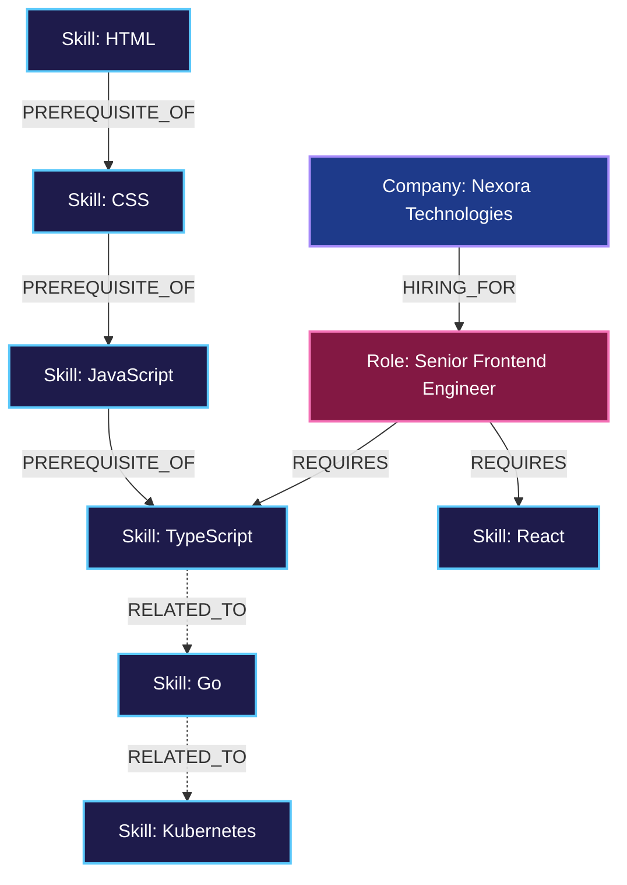
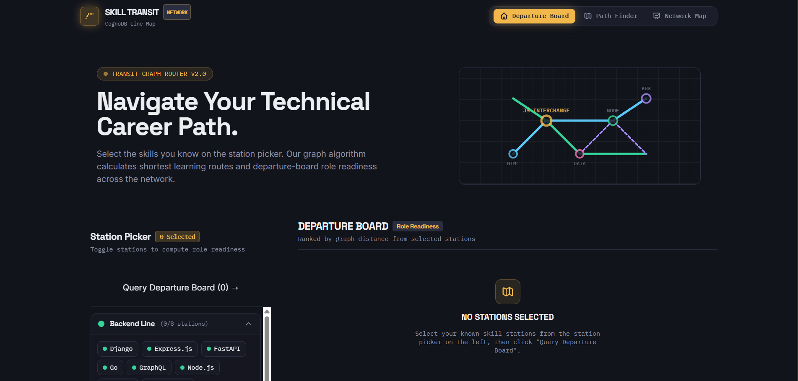
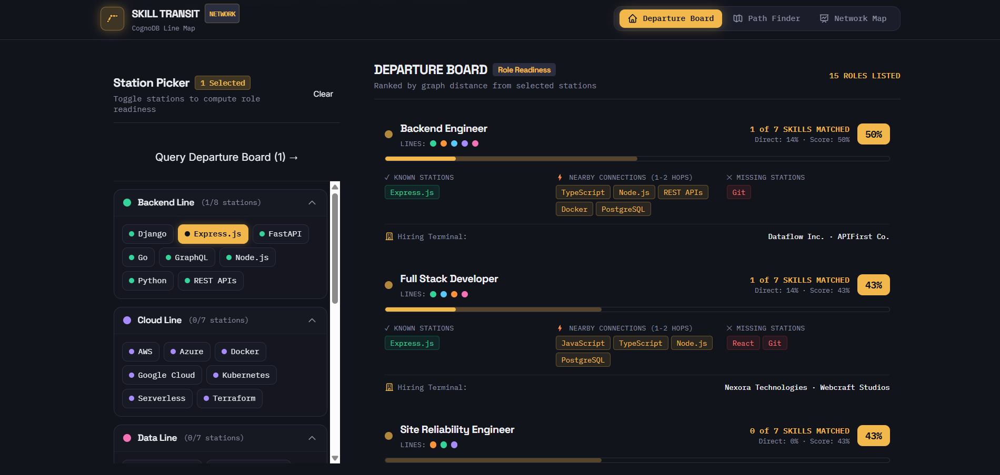
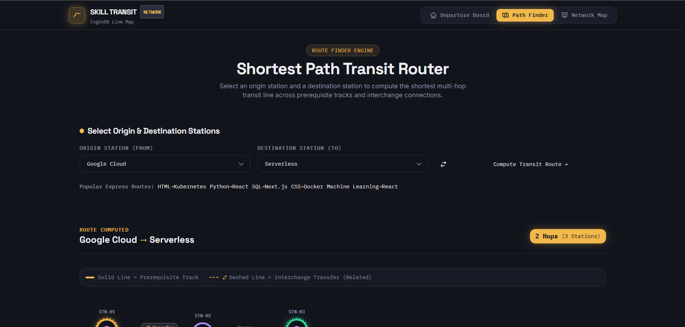
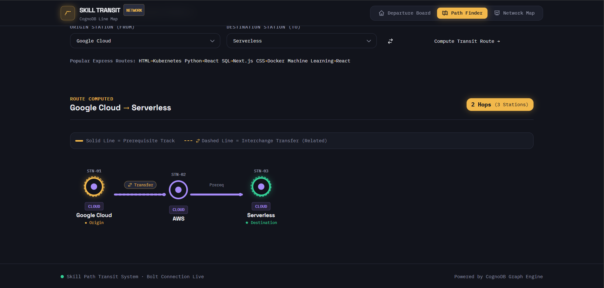
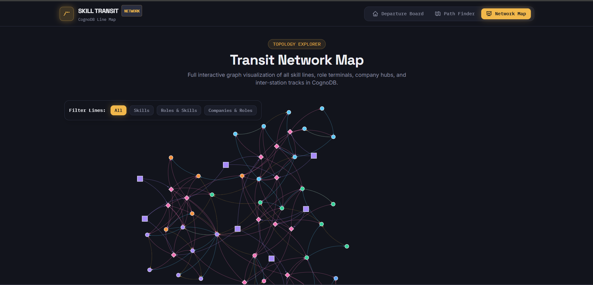
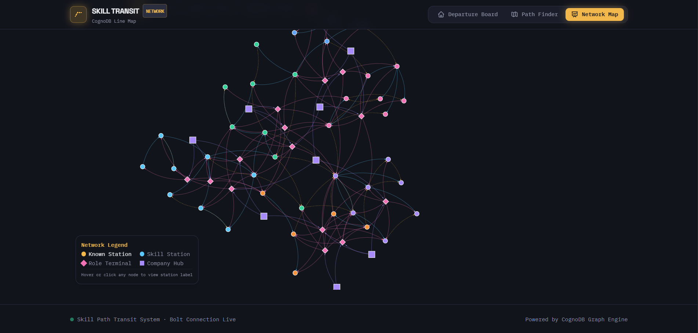

# Skill Path Finder 🚇

> A full-stack graph database application built with **Nuxt 4**, **Node.js (Express + TypeScript)**, and **CognoDB (openCypher)**. Skill Path Finder uses a **Transit Map** metaphor to help users discover the shortest learning route from skills they know to target job roles or target skills, rendering transit line diagrams and departure-board role readiness.

**Live demo:** [skill-path-finder-lilac.vercel.app](https://skill-path-finder-lilac.vercel.app/) · **API:** [api-2swj.vercel.app](https://api-2swj.vercel.app/)

---

## 🎯 Use Case

When navigating a technical career path or preparing for job transitions:
1. **Skill Gaps**: Job seekers often know a set of skills (e.g. `HTML`, `CSS`, `JavaScript`, `React`) but don't know the exact learning sequence or prerequisites required to reach complex technologies like `Kubernetes` or `Machine Learning`.
2. **Role Proximity**: Traditional job boards evaluate role suitability by simple keyword matching. Skill Path Finder calculates graph-based proximity — accounting for skills the user knows directly *plus* skills that are only 1-2 hops away in the technology graph.
3. **Shortest Transit Paths**: Traverses prerequisite (`PREREQUISITE_OF`) and complementary (`RELATED_TO`) relationships to find multi-hop paths between distant skills.

---

## 🕸️ Why a Graph Database?

Relational databases (RDBMS) struggle with highly connected domain models like skill trees, prerequisite hierarchies, and graph pathfinding:

| Feature | Relational Database (RDBMS) | Graph Database (CognoDB / Cypher) |
| :--- | :--- | :--- |
| **Path Traversal** | Requires expensive, complex recursive CTEs (`WITH RECURSIVE`) or multiple nested `JOIN` queries. | Native constant-time pointer chasing using Cypher's `shortestPath()` function. |
| **Flexible Schema** | Rigid schema tables for every relationship type (`skills_prerequisites`, `role_skills`, etc.). | Fluid node labels (`:Skill`, `:Role`, `:Company`) and rich typed relationships (`:PREREQUISITE_OF`, `:RELATED_TO`, `:REQUIRES`, `:HIRING_FOR`). |
| **Performance** | Query execution time scales exponentially with traversal depth (\(O(N^d)\)). | Execution time scales with the localized subgraph size rather than overall database size. |
| **Query Readability** | 50+ lines of SQL with multiple join tables. | Clean 3-line openCypher pattern matching: `MATCH p = shortestPath((a)-[*]-(b))`. |

---

## 📐 Data Model & Line Legend

### Node Labels & Transit Color Palette
- `(:Skill {name: string, category: string})`
  - **Frontend Line**: `#5AC8FA` (Cyan Blue Line)
  - **Backend Line**: `#34D399` (Emerald Green Line)
  - **Cloud Line**: `#A78BFA` (Purple Line)
  - **Data Line**: `#F472B6` (Pink Line)
  - **DevOps Line**: `#FB923C` (Orange Line)
  - **Data Science Line**: `#60A5FA` (Blue Line)
  - **Known Station Accent**: `#F2B84B` (Transit Gold)
- `(:Role {title: string})`
- `(:Company {name: string})`

### Relationships
- `(:Skill)-[:PREREQUISITE_OF]->(:Skill)` (Prerequisite Track — Solid Line)
- `(:Skill)-[:RELATED_TO]->(:Skill)` (Interchange Transfer — Dashed Line)
- `(:Role)-[:REQUIRES]->(:Skill)` (Role Requirement)
- `(:Company)-[:HIRING_FOR]->(:Role)` (Company Hiring Terminal)

### Mermaid Graph Diagram



---

## 🛠️ Stack & Architecture

- **Frontend**: Nuxt 4 (Vue 3 + TypeScript + Tailwind CSS + `vis-network`)
- **Backend**: Express.js + TypeScript + `neo4j-driver` (`disableLosslessIntegers: true`)
- **Database**: CognoDB (Bolt protocol, openCypher)

---

## 🔑 Environment Setup & Connection Details

### 1. Clone the repository

```bash
git clone https://github.com/Akshat565503/skill-path-finder.git
cd skill-path-finder
```

### 2. Create your own CognoDB instance

1. Sign up at [console.cognodb.com/signup](https://console.cognodb.com/signup) (free tier, no card required).
2. Create a free (c0) instance and pick a region — provisions in under a minute.
3. Copy the generated **Bolt URI** and **password** shown on instance creation. The password is shown once — save it immediately.

### 3. Configure environment variables

Create `api/.env` (never committed — see `.gitignore`):

```env
# CognoDB Connection Details — use YOUR OWN instance credentials here
BOLT_URI=bolt+s://your-instance-id.databases.cognodb.com
BOLT_USER=cognodb
BOLT_PASSWORD=your-password-here

# Server Port
PORT=4000
```

Create `web/.env`:

```env
NUXT_PUBLIC_API_BASE=http://localhost:4000
```

> **Security Note**: `.env` files are excluded via `.gitignore` and must never be committed to source control. Use the `.env.example` templates in each folder as a reference — they contain placeholder values only.

---

## 🚀 Installation & Local Execution

```bash
# Install dependencies for root monorepo, API, and Web
npm run install:all

# Run Database Seed Script (Clears and populates 40 skills, 15 roles, 8 companies, 185 edges)
npm run seed --prefix api

# Run API and Web Dev Servers
# Terminal 1 (API Server on http://localhost:4000)
npm run dev:api

# Terminal 2 (Web Frontend on http://localhost:3000)
npm run dev:web
```

---

## 🔍 Core Cypher Queries Explained

### 1. List All Skills Grouped by Category (`GET /api/skills`)
**Explanation**: Fetches all `:Skill` nodes, ordered by category and skill name.
```cypher
MATCH (s:Skill)
RETURN s.name AS name, s.category AS category
ORDER BY s.category, s.name
```

### 2. Shortest Learning Path Between Skills (`POST /api/path`)
**Explanation**: Finds the shortest undirected path traversing `:PREREQUISITE_OF` and `:RELATED_TO` relationships between two skills.
```cypher
MATCH p = shortestPath(
  (a:Skill {name: $from})-[:PREREQUISITE_OF|RELATED_TO*]-(b:Skill {name: $to})
)
RETURN
  [n IN nodes(p) | {name: n.name, category: n.category}] AS path,
  length(p) AS hops,
  [r IN relationships(p) | type(r)] AS relationshipTypes
```

### 3. Matched Roles Departure Board (`POST /api/matched-roles`)
**Explanation**: For each role, counts directly known skills and checks for missing skills that are reachable within 1-2 hops. Scores roles dynamically and returns hiring companies.
```cypher
MATCH (role:Role)-[:REQUIRES]->(reqSkill:Skill)
WITH role, collect(reqSkill.name) AS requiredSkills

WITH role, requiredSkills,
     [s IN requiredSkills WHERE s IN $knownSkills] AS knownDirectly,
     [s IN requiredSkills WHERE NOT s IN $knownSkills] AS missingSkills

UNWIND CASE WHEN size(missingSkills) > 0 THEN missingSkills ELSE [null] END AS missingSkill

OPTIONAL MATCH p = shortestPath(
  (known:Skill)-[:PREREQUISITE_OF|RELATED_TO*1..2]-(target:Skill {name: missingSkill})
)
WHERE known.name IN $knownSkills AND missingSkill IS NOT NULL

WITH role, requiredSkills, knownDirectly, missingSkill,
     min(CASE WHEN p IS NOT NULL THEN length(p) ELSE null END) AS minHops

WITH role, requiredSkills, knownDirectly,
     collect(
       CASE WHEN missingSkill IS NOT NULL THEN {
         skill: missingSkill,
         nearby: minHops IS NOT NULL,
         hops: minHops
       } ELSE null END
     ) AS missingDetails

WITH role, requiredSkills, knownDirectly,
     [md IN missingDetails WHERE md IS NOT NULL] AS missingDetails

WITH role, requiredSkills, knownDirectly,
     [md IN missingDetails WHERE md.nearby = true] AS nearbySkills,
     [md IN missingDetails WHERE md.nearby = false] AS farSkills,
     size(requiredSkills) AS totalRequired,
     toFloat(size(knownDirectly)) / size(requiredSkills) AS directMatchRatio

WITH role, requiredSkills, knownDirectly, nearbySkills, farSkills, totalRequired, directMatchRatio,
     CASE WHEN toFloat(size(knownDirectly) + size(nearbySkills) * 0.5) / totalRequired > 1.0
          THEN 1.0
          ELSE toFloat(size(knownDirectly) + size(nearbySkills) * 0.5) / totalRequired
     END AS overallScore

OPTIONAL MATCH (company:Company)-[:HIRING_FOR]->(role)
RETURN
  role.title AS title,
  requiredSkills,
  knownDirectly,
  [ns IN nearbySkills | ns.skill] AS nearbySkills,
  [fs IN farSkills | fs.skill] AS missingSkills,
  totalRequired,
  directMatchRatio,
  overallScore,
  collect(DISTINCT company.name) AS hiringCompanies
ORDER BY overallScore DESC, directMatchRatio DESC
```

### 4. Role Detail (`GET /api/roles/:title`)
**Explanation**: Retrieves full skill requirements and hiring companies for a specific role title.
```cypher
MATCH (role:Role {title: $title})
OPTIONAL MATCH (role)-[:REQUIRES]->(skill:Skill)
WITH role, collect({name: skill.name, category: skill.category}) AS skills
OPTIONAL MATCH (company:Company)-[:HIRING_FOR]->(role)
RETURN
  role.title AS title,
  skills,
  collect(DISTINCT company.name) AS companies
```

---

## 🖼️ Application Screenshots

| | |
|---|---|
|  |  |
|  |  |
|  |  |

---

## 🎥 Demo Recording

A short screen recording demonstrating the Departure Board, Path Finder, and Network Map is included at:
[`docs/Screenrecording/Skill path finder recording.mp4`](docs/Screenrecording/Skill%20path%20finder%20recording.mp4)

---

## 🌐 Live Deployment

- **Frontend App**: [https://skill-path-finder-lilac.vercel.app/](https://skill-path-finder-lilac.vercel.app/) *(Deployed on Vercel)*
- **Backend API**: [https://api-2swj.vercel.app/](https://api-2swj.vercel.app/) *(Deployed on Vercel)*
- **Database**: CognoDB Cloud (managed graph database instance)
